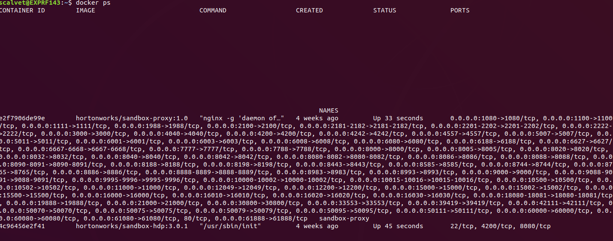

# Data Lakes

## Installation

```shell
unzip HDP_3.0.1_docker-deploy-scripts_18120587fc7fb.zip
cd HDP_3.0.1_docker-deploy-scripts_18120587fc7fb/
sh docker-deploy-hdp30.sh
```
Verify sandbox was deployed successfully by issuing the command: `docker ps`



* In order to stop the HDP sandbox just run:
    * `docker stop sandbox-hdp`
    * `docker stop sandbox-proxy`
* To remove the containers you just need to do:
    * `docker rm sandbox-hdp`
    * `docker rm sandbox-proxy`
* To remove the image just run:
    * `docker rmi hortonworks/sandbox-hdp:3.0.1`
    * `docker rmi hortonworks/sandbox-proxy:1.0`
* To start just run:
    * `docker start sandbox-hdp`
    * `docker start sandbox-proxy`

To access:


http://localhost:8080/#/login
