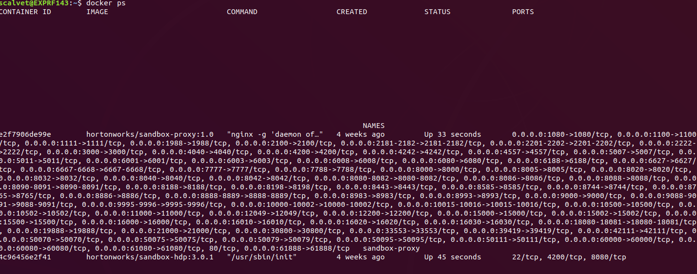

# Data Lakes

## Installation

```shell
mkdir HDP_3.0.1
unzip HDP_3.0.1_docker-deploy-scripts_18120587fc7fb.zip -d HDP_3.0.1
cd HDP_3.0.1/
sh docker-deploy-hdp30.sh

docker start sandbox-hdp
docker start sandbox-proxy

echo "visit http://localhost:1080/"
```

## Run


* In order to stop the HDP sandbox just run:
    * `docker stop sandbox-hdp`
    * `docker stop sandbox-proxy`
* To remove the containers you just need to do:
    * `docker rm sandbox-hdp`
    * `docker rm sandbox-proxy`
* To remove the image just run:
    * `docker rmi hortonworks/sandbox-hdp:3.0.1`
    * `docker rmi hortonworks/sandbox-proxy:1.0`
* To start just run:
    * `docker start sandbox-hdp`
    * `docker start sandbox-proxy`

```shell
dockec-compose up -d
```

## URLs

| Tool              | URL                         | Credentials    |
| ----------------- | --------------------------- | -------------- |
| zeppelin          | http://localhost:8080/      | - |
| nifi              | http://localhost:8081/nifi/ | - |
| spark             | bitnami/spark:3.0.1                | 7077           | shared-workspace |
| kibana            | kibana/kibana:7.10.1               | 5601           | - |


Verify sandbox was deployed successfully by issuing the command: `docker ps`
